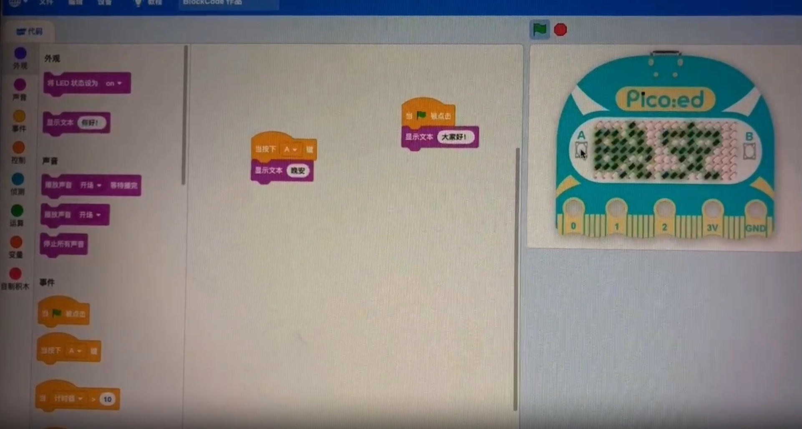
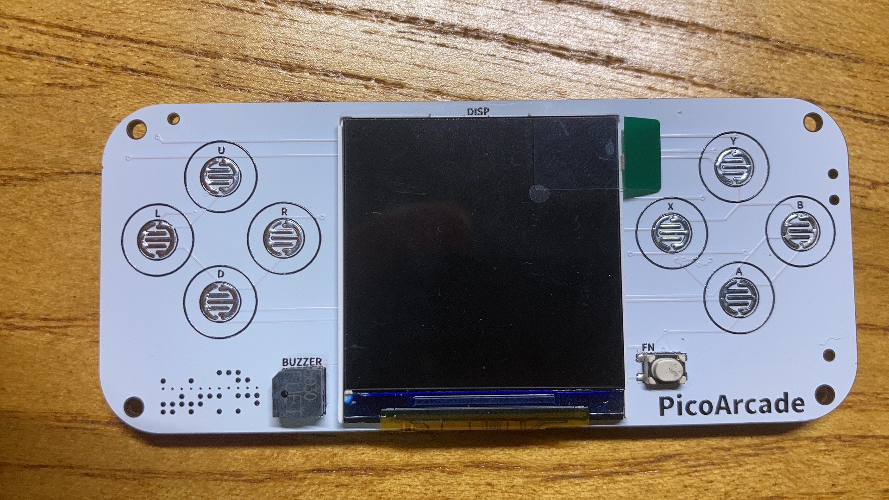
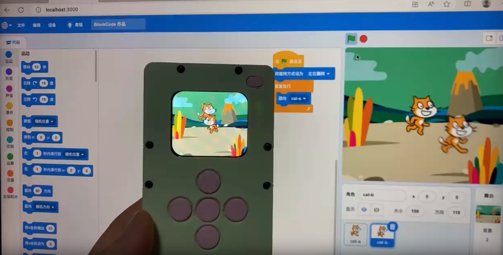

## 开发故事

本人从小就热爱玩游戏，并从事游戏开发工作十多年，自2018年开始接触到Scratch少儿编程，一开始只是完成由游戏开发者到少儿编程教育工作者转型。由于工作关系接触到了开源硬件micro:bit, 偶然发现micro:bit V2加上LCD屏幕可以使用MakeCode Arcade图形化工具来开发游戏。任何人真的可以通过图形化的工具给自己制作开发游戏还可以下载到游戏机里面去玩。接触这个软件后对我一个传统游戏开发者来说是非常震惊的，于是立马淘宝上买了一个回来玩，玩了一阵子后，职业的原因让我发现了一些用户体验问题，MakeCode Arcade编程所有的游戏场景，背景，元素全部在一个主程序里面，并且控制器都要依赖游戏机本身的硬件，这样导致游戏程序的编写难度偏大。别说是小朋友和新手用户，就算是我这个游戏开发多年的人来说都感觉有点绕，MakeCode Arcade还是有一种程序员在做游戏开发的影子在里面。相比而言Scratch游戏编程就显得简单很多，常用图标，声音元素可以直接使用自带的或者电脑上传，不需要全部靠编程去实现。不同角色可以独立模块化编程，无论是编程框架还是编程思想，用户都能很容易理解。我在实际教学应用中也验证了这点，教学难度Scratch远低于MakeCode Arcade。

随着工作的深入了解，发现国内大部分少儿编程机构使用的教学软件和大家熟知的编程平台比如mind+，openblock，mblock……大都是基于原生Scratch做的二次开发。早期用户也几乎都是通过Scratch开展少儿编程教学发展起来的，还有国内Scratch普及程度非常高。MakeCode Arcade在国内用户就显得少了。于是我就萌生了一个想法，是否可以开发一款可以运行Scratch游戏的编程游戏机呢？

带着这个想法我开始做了如下尝试：

- 首先我想到的第一个方案是找直接运行Scratch原生格式的硬件，但是很快发现一个问题，其实原生Scratch是非常吃硬件CPU和内存的，即便是在树莓派上这样配置的设备上去运行原生Scratch也不是非常流程，那么选择能运行Linux带UI系统的硬件（比如全志/RK方案），但是最低成本也到了200RMB。显然这个方案就像把scratch放到了移动端来运行一样，虽然可行，但是硬件成本过高，但是做出来无论是价格上还是优势并不明显，还不如做手机APP来得简单。
- 很快我又构思了第二个方案，就是设备上不需要去执行原生Scratch应用软件，参考Scratch源码写一个类似可以解析运行sb3格式的程序。但是这里又有问题，原生Scratch除了执行程序外还有很多元素，图标等资源文件，这些资源文件大概有几十兆得先内置到硬件里面，如果上位机增加修改了资源文件，那么下位机就必须升级固件才能同步。并且同样对硬件内存依然也还要求比较高，且编写这个软件难度真不小。

通过前面两次思考论证，我重新总结需求，做了一些调整，把核心需求列出来

- 硬件最好是现在主流开源硬件，硬件BOM成本控制在100内，方便制作和复刻，兼容性要强，方便开发固件，扩展功能等。
- 其实大家喜欢是Scratch编程方式，比如mblock，mind+，编程猫……这些类似Scratch方式大家都能很快适应。那么我们只需要尽可能地保持Scratch编程方式，不必执念一定要去运行原生Scratch格式。

有了前面得总结，很快我在MakeCode软件里面micro:bit主板模拟器里找到了灵感，Scratch舞台本质上也是一个模拟器，想通这一点，我的硬件运行的游戏就不需要是原生Scratch的sb3文件，我可以自己定义游戏运行方式，再在Scratch软件重写一个对应我硬件的模拟器替代原本的Scratch舞台。这样Scratch软件只有舞台相对于原生的有些变化之外，其他几乎一摸一样。

为了实现这些想法，我重新创建了一个新的Scratch框架（原生的Scratch框架不太适合做大改动，所以我从头搭建了一个新的框架）——我称之为**BlockCode框架**。当时手里有一块Pico:ed（基于RP2040主控）主板硬件，于是我在**BlockCode框架**里面做了可以模拟Pico:ed按键和显示功能：



但是我们是要做游戏，肯定需要带屏幕，于是我又做了一个基于RP2040带LCD屏幕的硬件（自学硬件设计，第一次画PCB板）。



当时这个项目也有开源[https://gon.gyeq.in/#/2023/0617/](https://gon.gyeq.in/#/2023/0617/)（现已经删除）。

在使用RP2040做主控时，很快我又发现了新的问题。RP2040主频只有133M，在做图片刷新时有点吃力，RP2040在外设扩展时时开源资料并不多，后续扩展功能也有些费劲，于是我把目光放到了ESP32-S3上，240M主频，支持WiFi/蓝牙可扩展功能足够多。于是我重新做了新的基于ESP32-S3的新硬件：



历时半年基本实现了基本功能，但是还是觉得这个不像游戏机，于是加大了LCD屏幕，改成了游戏机模样，最后就是大家见到的开源的样子。好了其实在整个开发验证过程中花费时间一年半，有非常多的技术细节，也遇到了非常多的技术挑战点，大致有如下：

1. 编程方式要原封不动兼容原生Scratch然后用模拟器替代舞台
1. 游戏运行流程程度，在单片机的主控上LCD屏幕刷新速率
1. 联网功能，录音功能，播放声音功能也要在游戏机上实现
1. 目标要能打开sb3游戏格式

为了致敬MakeCode Arcade和Scratch这两个经典且强大的平台，于是本游戏机叫做——

# Scratch Arcade


这是一款针对少儿编程可编程游戏机硬件产品，解决当前Scratch教学模式单一，程序模版化，没有硬件关联，导致学生兴趣下滑。这款产品将完全弥补这些不足，提升教学内容的丰富性，程序的多样性和变化性，学生的成就感获得完全提升，并且**完全不改变现在已有的教学内容，完全拿来即用。**

## 硬件特性

| 硬件  | 说明                                                                       |
| --- | ------------------------------------------------------------------------ |
| 芯片  | **ESP32-S3** Xtensa©**双核 240 MHz** <br /> 8MB SPI flash <br /> 8MB PSRAM |
| 屏幕  | 2.0寸 **320×240** 高清彩屏                                                    |
| 网络  | 802.11b/g/n Wi-Fi <br /> Bluetooth 5 (LE)                                |
| 按钮  | 编程按钮 × 9                                                                 |
| 声音  | 扬声器 × 1                                                                  |
| 尺寸  | 100mm × 38mm                                                             |

> 此为开源版本硬件配置，教育版本硬件介绍[点我（arcade.blockcode.fun）](https://arcade.blockcode.fun/)查看。

### 屏幕

**2.0寸** 大屏幕的TFT彩色屏幕，支持多达 65536 种丰富的颜色（**16位色**），分辨率达到 **320×240** 像素，可以呈现游戏广阔的舞台，结合 TileMap（敬请期待） 实现庞大的 2D 游戏世界。

### 网络

由 ESP32-S3 带来的强大网络功能，支持 802.11b/g/n Wi-Fi 和 Bluetooth 5 (LE)。**多台游戏机还可以实现多机互联，实现联网最互动**。

### 交互

**9个按钮**——八个标准游戏按钮（**上/下/左/右/A/B/X/Y**）和一个功能（**Fn**）按钮，通过编程赋予按钮不同的功能，实现各种游戏玩法，丰富程序交互能力。

### 实物照片


## 编写程序

在 [BlockCode Playgrounds](https://make.blockcode.fun/) 使用图形化（Scratch）或 MicroPython 进行编程。


### 图形化（Scratch）


界面与Scratch完全一样，大部分的编程积木模块也都一样，少部分因为硬件特征有所不同（以后缺少的部分会逐步补全，更贴近原版 Scratch 的积木模块和功能），更方便熟悉Scratch的老师进行教学。

|     | 差异                                                                                                                 |
| --- | ------------------------------------------------------------------------------------------------------------------ |
| 舞台  | 宽高比和原版Scratch保持一致，但分辨率有所减小——320×240，x坐标从-160到160，y坐标从-120到120。<br />不显示变量，变量内容的显示将在新增的“数据监控”（敬请期待）。                |
| 造型  | 造型资源只有位图模式，不支持矢量图模式，Scratch 中的造型都可以使用。                                                                             |
| 背景  | 除了Scratch中的位图背景，还支持 **TileMap背景**以及**AI背景**（敬请期待）。<br /> **TileMap背景**使用瓦片图制作超大的游戏地图；**AI背景**使用生成式AI通过文字来生成一副位图背景。 |
| 声音  | 只能使用wav格式声音文件，长度不超过10s或大小不超过200kB，单声道音频。                                                                           |

### MicroPython

固件基于 MicroPython 1.2x 版本编译，增加了特有的包，更方便开发游戏和小程序。

> MicroPython 编程平台敬请期待，也推荐使用 [Arduino Lab for MicroPython](https://labs.arduino.cc/en/labs/micropython) 一个轻量化的MicroPython编辑器进行编程。

## 原理图和PCB


> 完整项目请访问[立创开源硬件平台](https://oshwhub.com/blockcodelab/arcade_lite)。

## 项目连接

- 立创开源硬件平台: [https://oshwhub.com/blockcodelab/arcade_lite](https://oshwhub.com/blockcodelab/arcade_lite)
- GitHub: [https://github.com/BlockCodeLab/arcade-lite](https://github.com/BlockCodeLab/arcade-lite)
- Gitee: [https://gitee.com/blockcodelab/arcade-lite](https://gitee.com/blockcodelab/arcade-lite)

### 固件下载

- 最新固件: [去下载](./firmware)最新版本，按住BOOT键（FN键）同时将硬件连接电脑，在终端用下面命令刷固件：
  ```
  esptool.py --chip auto --port [PORT] write_flash -z 0 arcade_lite.v0.9_mpy_v1.23.0.bin
  ```
- NES模拟器: 稍等片刻

## 感谢

- [易创空间](https://www.emakefun.com/)对教育版产品的生产支持。

______________________________________________________________________

**欢迎大家加群来交流。**

本开源项目历时一年半时间的开发和优化，最大的成就是验证了最初想法的可行性，当前只是一个开源版本，教育版有许多有趣且惊喜的功能，比如语音对讲，AI，FPV图传等功能。但也有许多地方需要完善和优化，欢迎大家进群提建议和交流。


