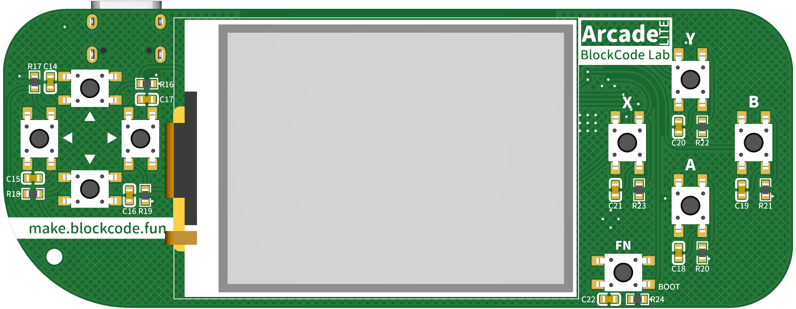
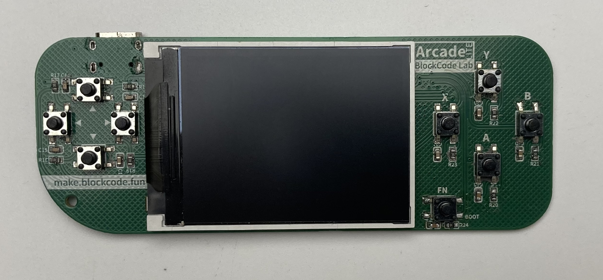
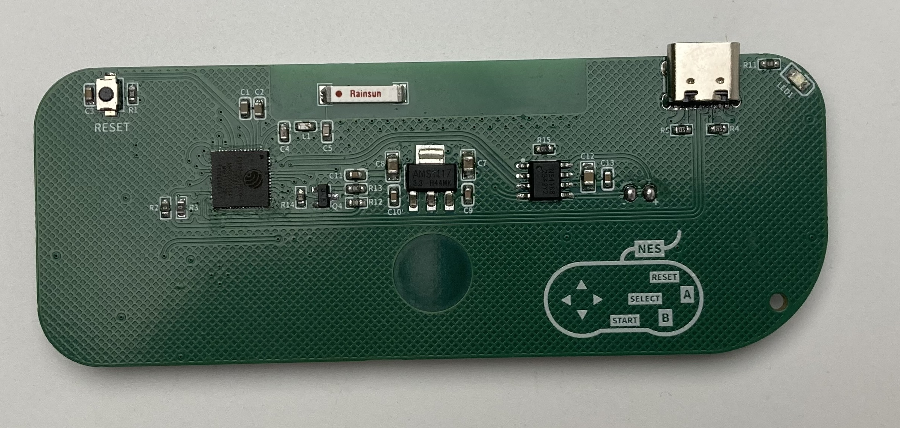
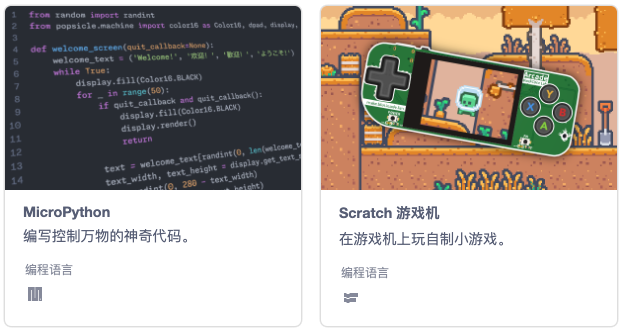
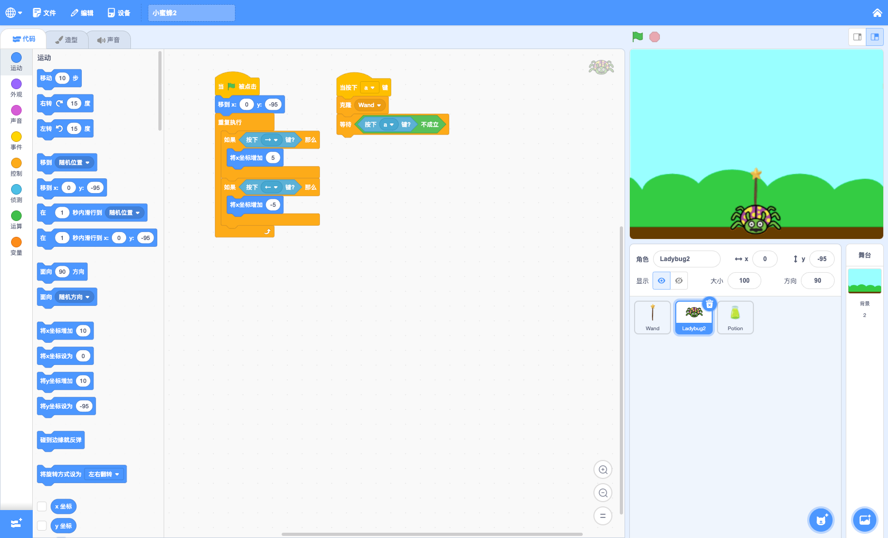
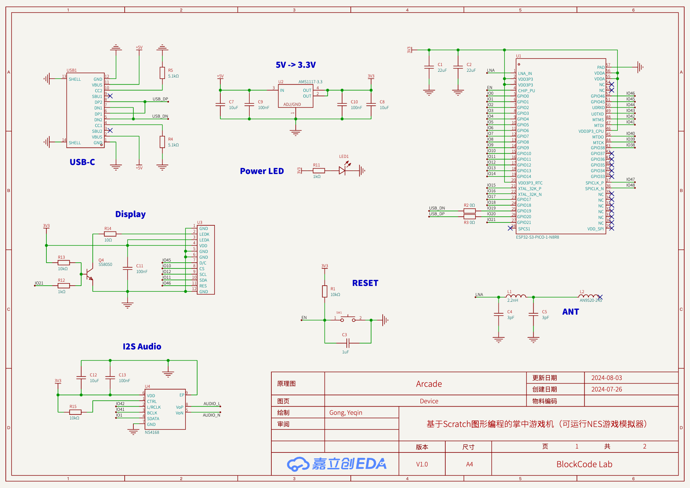
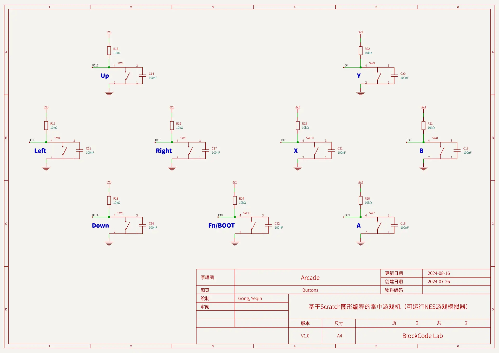
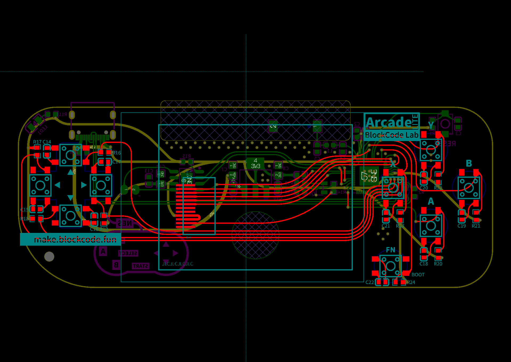

这是一款少儿编程硬件产品，非常符合国内目前的小学阶段编程教育（Scratch图形化和Python编程），以往的编程学习在教学过程中逐渐变得模式单一，程序模版化，学生兴趣下滑。这款产品将完全弥补这些不足，提升教学内容的丰富性，程序的多样性和变化性，学生的成就感获得完全提升，并且**完全不改变现在已有的教学内容，完全拿来即用。**

## 硬件特性

| 硬件  | 说明                                                                       |
| --- | ------------------------------------------------------------------------ |
| 芯片  | **ESP32-S3** Xtensa©**双核 240 MHz** <br /> 8MB SPI flash <br /> 8MB PSRAM |
| 屏幕  | 2.0寸 **320×240** 高清彩屏                                                    |
| 网络  | 802.11b/g/n Wi-Fi <br /> Bluetooth 5 (LE)                                |
| 按钮  | 编程按钮 × 9                                                                 |
| 声音  | 扬声器 × 1                                                                  |
| 尺寸  | 100mm × 38mm                                                             |

> 此为开源版本硬件配置，教育版本硬件介绍[点我（arcade.blockcode.fun）](https://arcade.blockcode.fun/)查看。

### 屏幕

**2.0寸** 大屏幕的TFT彩色屏幕，支持多达 65536 种丰富的颜色（**16位色**），分辨率达到 **320×240** 像素，可以呈现游戏广阔的舞台，结合 TileMap（敬请期待） 实现庞大的 2D 游戏世界。

### 网络

由 ESP32-S3 带来的强大网络功能，支持 802.11b/g/n Wi-Fi 和 Bluetooth 5 (LE)。**多台游戏机还可以实现多机互联，实现联网最互动**。

### 交互

**9个按钮**——八个标准游戏按钮（**上/下/左/右/A/B/X/Y**）和一个功能（**Fn**）按钮，通过编程赋予按钮不同的功能，实现各种游戏玩法，丰富程序交互能力。

### 实物照片



## 编写程序

在 [BlockCode Playgrounds](https://make.blockcode.fun/) 使用图形化（Scratch）或 MicroPython 进行编程。



### 图形化（Scratch）



界面与Scratch完全一样，大部分的编程积木模块也都一样，少部分因为硬件特征有所不同（以后缺少的部分会逐步补全，更贴近原版 Scratch 的积木模块和功能），更方便熟悉Scratch的老师进行教学。

|     | 差异                                                                                                                 |
| --- | ------------------------------------------------------------------------------------------------------------------ |
| 舞台  | 宽高比和原版Scratch保持一致，但分辨率有所减小——320×240，x坐标从-160到160，y坐标从-120到120。<br />不显示变量，变量内容的显示将在新增的“数据监控”（敬请期待）。                |
| 造型  | 造型资源只有位图模式，不支持矢量图模式，Scratch 中的造型都可以使用。                                                                             |
| 背景  | 除了Scratch中的位图背景，还支持 **TileMap背景**以及**AI背景**（敬请期待）。<br /> **TileMap背景**使用瓦片图制作超大的游戏地图；**AI背景**使用生成式AI通过文字来生成一副位图背景。 |
| 声音  | 只能使用wav格式声音文件，长度不超过10s或大小不超过200kB，单声道音频。                                                                           |

### MicroPython

固件基于 MicroPython 1.2x 版本编译，增加了特有的包，更方便开发游戏和小程序。

> MicroPython 编程平台敬请期待，也推荐使用 [Arduino Lab for MicroPython](https://labs.arduino.cc/en/labs/micropython) 一个轻量化的MicroPython编辑器进行编程。

## 原理图和PCB





> 完整项目请访问[立创开源硬件平台](https://oshwhub.com/blockcodelab/arcade_lite)。

## 项目连接

- 立创开源硬件平台: [https://oshwhub.com/blockcodelab/arcade_lite](https://oshwhub.com/blockcodelab/arcade_lite)
- GitHub: [https://github.com/BlockCodeLab/arcade-lite](https://github.com/BlockCodeLab/arcade-lite)
- Gitee: [https://gitee.com/blockcodelab/arcade-lite](https://gitee.com/blockcodelab/arcade-lite)

### 固件下载

- 最新固件: [去下载](./firmware)最新版本，将硬件连接电脑，在终端用下面命令刷固件：
  ```
  esptool.py --chip auto --port <PORT> write_flash -z 0 arcade_lite.v0.9_mpy_v1.23.0.bin
  ```
- NES模拟器: 稍等片刻

## 感谢

- [易创空间](https://www.emakefun.com/)对教育版产品的生产支持。

______________________________________________________________________

**欢迎大家加群来交流。**


